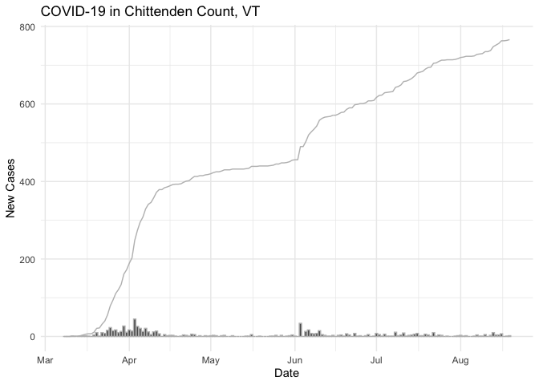
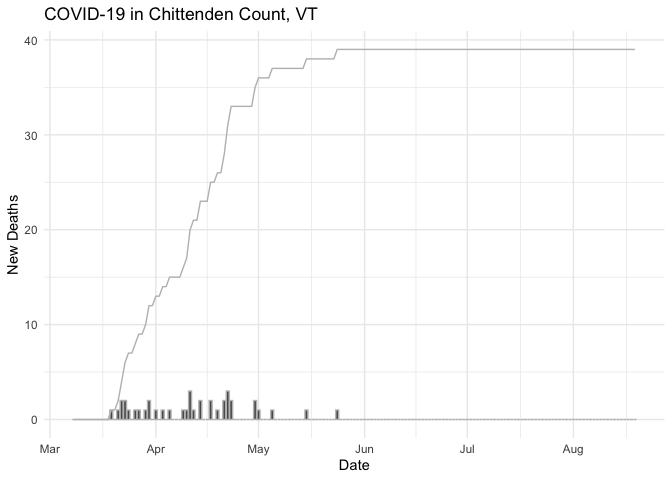
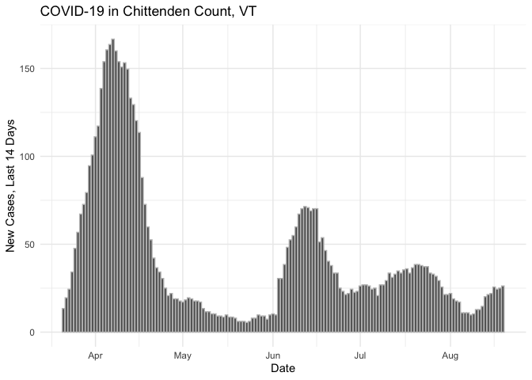

# COVID-19 Data and Charts for Chittenden County, Vermont.

The [official COVID-19 dashboard from the Vermont Department of Health][1] doesn't show timeseries data for individual counties, so I pulled down [the raw data][2] to make my own plots.

## New and Cumulative Cases

## New and Cumulative Deaths

## 14 Day Rolling Sum, New Cases

[1]: https://experience.arcgis.com/experience/85f43bd849e743cb957993a545d17170
[2]: https://geodata.vermont.gov/datasets/vt-covid-19-cases-by-county-time-series/data?page=16&where=map_county%20%3D%20%27Chittenden%20County%27

