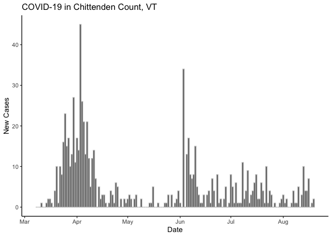
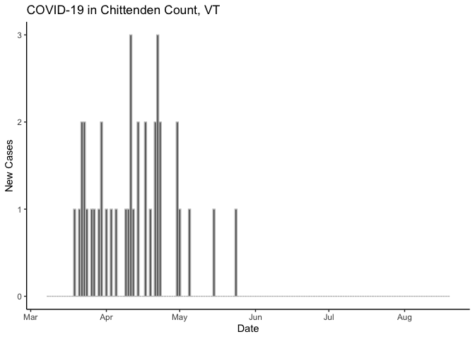
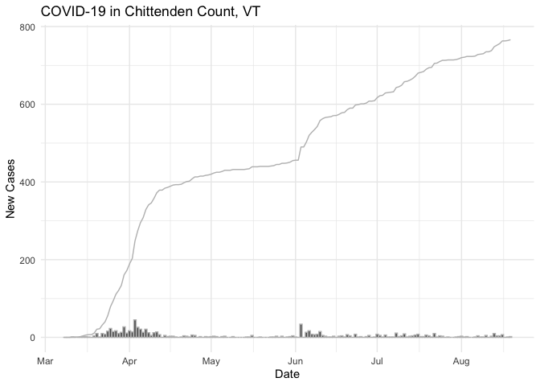
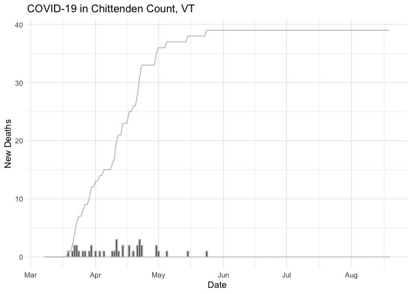

    CHITTENDEN_DATA_URL <- "https://services1.arcgis.com/BkFxaEFNwHqX3tAw/arcgis/rest/services/VIEW_EPI_CountyDailyCountTS_PUBLIC/FeatureServer/0/query?where=CNTYGEOID%3D50007&outFields=date,C_New,D_New&returnGeometry=false&outSR=4326&f=json"

    getLatestCovidData <- function() {
      res <- httr::GET(CHITTENDEN_DATA_URL)
      jsonlite::fromJSON(httr::content(res, "text"))$features$attributes %>%
        rename(new_cases=C_New, new_deaths=D_New) %>%
        mutate(date = as.POSIXct(date/1000, origin="1970-01-01"))  
    }

    covid <- getLatestCovidData()
    tail(covid)

    ##           date new_cases new_deaths
    ## 156 2020-08-10         5          0
    ## 157 2020-08-11         0          0
    ## 158 2020-08-12         3          0
    ## 159 2020-08-13        10          0
    ## 160 2020-08-14         4          0
    ## 161 2020-08-15         4          0

    ggplot(covid) +
      geom_bar(aes(x=date, y=new_cases), stat='identity', color='gray') +
      labs(x="Date", y="New Cases", title="COVID-19 in Chittenden Count, VT") +
      theme_classic()

    ggplot(covid) +
      geom_bar(aes(x=date, y=new_deaths), stat='identity', color='gray') +
      labs(x="Date", y="New Cases", title="COVID-19 in Chittenden Count, VT") +
      theme_classic()

    ggplot(covid) +
      geom_bar(aes(x=date, y=new_cases), stat='identity', color='gray') +
      geom_line(aes(x=date, y=cumsum(new_cases)), color="gray") +
      labs(x="Date", y="New Cases", title="COVID-19 in Chittenden Count, VT") +
      theme_minimal()

    ggplot(covid %>% mutate(active_cases = RcppRoll::roll_sumr(new_cases, n=14) / 163774 * 100000)) +
      geom_bar(aes(x=date, y=active_cases), stat='identity', color="gray") +
      labs(x="Date", y="New Cases, Last 14 Days", title="COVID-19 in Chittenden Count, VT") +
      theme_minimal()

    ## Warning: Removed 13 rows containing missing values (position_stack).

    ggplot(covid) +
      geom_bar(aes(x=date, y=new_deaths), stat='identity', color='gray') +
      geom_line(aes(x=date, y=cumsum(new_deaths)), color="gray") +
      labs(x="Date", y="New Deaths", title="COVID-19 in Chittenden Count, VT") +
      theme_minimal()

